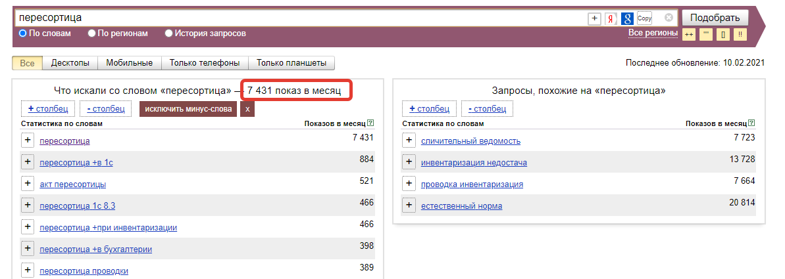

Установка и настройка
=====================

1. Установка расширения в 1С
----------------------------

Откройте конфигуратор 1С

В меню выбрать: Администрирование -> Расширения

2. Создание приложения в Битрикс24
----------------------------------

Под пользователем с административными правами открывает раздел "Приложения"

3. Подключение к порталу Битрикс24 из 1С
----------------------------------------

